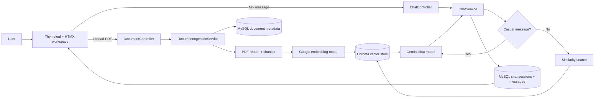
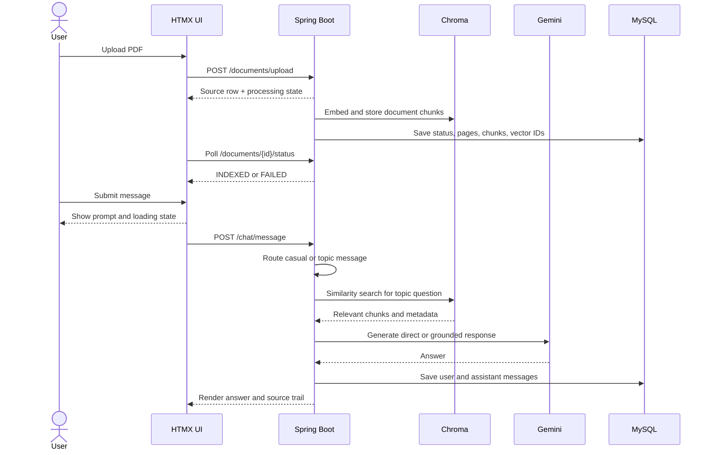

<div align="center">

<a name="top"></a>

# RAG Application Enterprise

### memInfo: a focused, source-grounded AI workspace for enterprise knowledge

<a href="https://github.com/soloStack-Dev/RAG-application_Enterprise/actions"></a>
<a href="https://github.com/soloStack-Dev/RAG-application_Enterprise"></a>
<a href="https://www.java.com/"></a>
<a href="https://spring.io/projects/spring-boot"></a>

<br>
<br>

<a href="https://github.com/DenverCoder1/readme-typing-svg"></a>

<br>

[Explore the architecture](#architecture) · [Run locally](#quick-start) · [Configuration](#configuration)

</div>

---

## What it is

RAG Application Enterprise is a practical Spring Boot RAG workspace named **memInfo**. Users upload PDF sources, follow their indexing status, ask questions in a persistent chat session, and see the source file and page used for grounded answers.

The chat has two deliberate modes:

- **Conversation mode:** greetings and simple chitchat go directly to Gemini.
- **Knowledge mode:** topic questions search the Chroma vector database and Gemini answers from the retrieved PDF chunks.

That keeps ordinary conversation natural while preserving the discipline expected from an enterprise knowledge assistant.

## Why it feels different

| Capability | Behavior |
| --- | --- |
| Source-first answers | Retrieved chunks are labeled with source file and page metadata. |
| Hybrid chat routing | Casual messages bypass retrieval; topic questions use the indexed knowledge base. |
| Visible ingestion state | Uploads move through `UPLOADED`, `PROCESSING`, `INDEXED`, or `FAILED`. |
| Source lifecycle | Removing a source removes its tracked vectors and SQL metadata. |
| Persistent workspace | Sessions, user prompts, AI responses, titles, and source references are stored in MySQL. |
| Responsive interaction | Thymeleaf fragments and HTMX swaps keep upload, history, chat, and loading states focused. |

## Architecture



### Request lifecycle



## Technology

- **Runtime:** Java 21
- **Application:** Spring Boot 4.1.1
- **AI integration:** Spring AI 2.0.1 with Google GenAI
- **Chat and embeddings:** Gemini chat model plus `gemini-embedding-2`
- **Vector store:** Chroma Cloud
- **Persistence:** MySQL with Spring Data JPA
- **Document processing:** Spring AI PDF/Tika readers
- **Web experience:** Thymeleaf, HTMX, Bootstrap, and focused vanilla JavaScript
- **Testing:** Spring Boot integration context and live embedding/vector-store smoke test

## Quick start

### Prerequisites

- Java 21
- A MySQL database
- A Google AI Studio API key
- A Chroma Cloud collection and API key
- Windows PowerShell for the commands below

### 1. Configure secrets

Create `rag-app/rag-app/.env`:

```properties
GEMINI_API_KEY=your_google_ai_studio_key
GEMINI_CHAT_MODEL=gemini-3.8-flash
GEMINI_EMBEDDING_MODEL=gemini-embedding-2

MYSQL_HOST=your_mysql_host
MYSQL_PORT=3306
MYSQL_DATABASE=your_database
MYSQL_USERNAME=your_username
MYSQL_PASSWORD=your_password

CHROMA_HOST=https://api.trychroma.com
CHROMA_API_KEY=your_chroma_api_key
CHROMA_TENANT=your_tenant
CHROMA_DATABASE=your_database
CHROMA_COLLECTION=rag-app
```

Never commit `.env` or expose API keys in screenshots, logs, or README files.

### 2. Run the application

The Maven project is nested under `rag-app/rag-app`:

```powershell
Set-Location .\rag-app\rag-app
.\mvnw.cmd spring-boot:run
```

Open [http://localhost:8080](http://localhost:8080).

### 3. Run tests

```powershell
Set-Location .\rag-app\rag-app
.\mvnw.cmd test
```

The verified suite includes the application context test and an end-to-end embedding/search/delete smoke test against the configured services.

## Configuration notes

The application imports `.env` relative to the process working directory. Always launch Maven from `rag-app/rag-app`; otherwise the environment file will not be loaded.

Important defaults live in `rag-app/rag-app/src/main/resources/application.properties`:

- Maximum PDF size: 20 MB
- Chunk size: 1000 characters
- Chunk overlap: 150 characters
- Retrieval top K: 4
- Chroma port: 443
- JPA schema mode: `update`

The Chroma host must include the `https://` scheme.

## Project map

```text
rag-app/
├── README.md
└── rag-app/
    ├── pom.xml
    ├── devlog/                 # Development history and verified fixes
    └── src/
        ├── main/java/com/example/rag_app/
        │   ├── Config/         # RAG properties and application configuration
        │   ├── Controller/     # Page, chat, and document endpoints
        │   ├── Entity/         # Chat sessions, messages, and document metadata
        │   ├── Repository/     # Spring Data JPA repositories
        │   └── Service/        # Parsing, chunking, ingestion, retrieval, Gemini
        ├── main/resources/
        │   ├── templates/      # Thymeleaf pages and HTMX fragments
        │   ├── static/css/     # memInfo visual system
        │   └── static/js/      # Upload polling and chat interaction
        └── test/               # Spring Boot and vector-store smoke tests
```

## Safety and data behavior

- PDF uploads are restricted to PDF content and a 20 MB maximum.
- Retrieved context is labeled with source and page metadata before generation.
- Empty or unrelated knowledge-base results receive a clear no-source response.
- Chat failures are rendered as a user-facing assistant message instead of a blank page.
- Deleting a source removes its tracked Chroma vectors and SQL metadata.
- Deleting a session removes its stored user and assistant messages.
- Credentials are read from environment configuration and are not part of application source.

## Roadmap

- [ ] Add streamed Gemini responses for a more immediate answer reveal.
- [ ] Add document-level filters and source pinning per chat session.
- [ ] Add evaluation fixtures for retrieval precision and groundedness.
- [ ] Add CI coverage for the application build and template rendering.

## License

This project is currently intended for private development and demonstration. Add a project license before distributing it publicly.

<div align="center">

[Back to top](#top)

</div>
